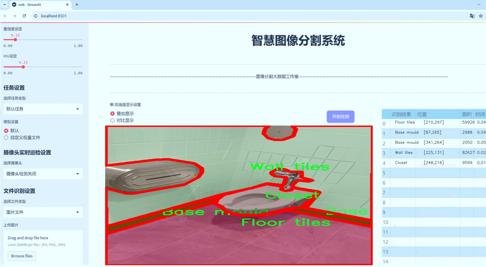
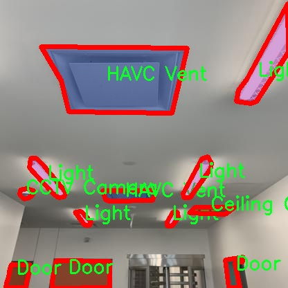

# 建筑室内物体实例分割系统源码＆数据集分享
 [yolov8-seg-C2f-DCNV3＆yolov8-seg-C2f-RFCAConv等50+全套改进创新点发刊_一键训练教程_Web前端展示]

### 1.研究背景与意义

项目参考[ILSVRC ImageNet Large Scale Visual Recognition Challenge](https://gitee.com/YOLOv8_YOLOv11_Segmentation_Studio/projects)

项目来源[AAAI Global Al lnnovation Contest](https://kdocs.cn/l/cszuIiCKVNis)

研究背景与意义

随着城市化进程的加快，建筑室内环境的复杂性和多样性日益增加，室内物体的识别与分割在建筑设计、智能家居、安防监控等领域的重要性愈发凸显。传统的室内物体识别方法多依赖于人工标注和规则引擎，效率低下且易受环境变化的影响。近年来，深度学习技术的迅猛发展为图像处理领域带来了新的机遇，尤其是目标检测和实例分割任务中，卷积神经网络（CNN）已成为主流的解决方案。其中，YOLO（You Only Look Once）系列模型因其高效的实时检测能力而备受关注。YOLOv8作为该系列的最新版本，进一步提升了模型的精度和速度，成为建筑室内物体实例分割的理想选择。

本研究旨在基于改进的YOLOv8模型，构建一个高效的建筑室内物体实例分割系统。为实现这一目标，我们将利用一个包含2800张图像和42个类别的专用数据集。该数据集涵盖了建筑室内常见的物体，如门、窗、灯具、地板材料等，具有较高的多样性和代表性。这些物体的准确识别和分割不仅有助于提高室内空间的智能化管理，还能为建筑设计提供重要的数据支持，推动智能建筑的发展。

在建筑室内物体实例分割的研究中，数据集的质量和多样性至关重要。我们所使用的数据集涵盖了从基础设施（如电气面板、管道、墙体）到装饰材料（如地毯、石材、天花板）等多种类别，能够有效地反映出建筑室内环境的复杂性。这为模型的训练和评估提供了丰富的样本，有助于提升模型的泛化能力和适应性。此外，针对特定类别的物体，研究者可以通过数据增强、迁移学习等技术，进一步提升模型的性能，确保其在实际应用中的可靠性。

本研究的意义不仅在于技术层面的创新，更在于其在实际应用中的广泛前景。随着智能家居和智慧城市的兴起，建筑室内物体的自动识别与管理将成为实现智能化的重要环节。通过构建基于改进YOLOv8的实例分割系统，我们能够为建筑行业提供更为精准的物体识别工具，助力室内空间的智能化改造。同时，该系统的成功应用也将为其他领域的图像处理提供借鉴，推动深度学习技术在更广泛场景中的应用。

综上所述，本研究不仅填补了建筑室内物体实例分割领域的技术空白，也为未来智能建筑的发展奠定了基础。通过深入探讨YOLOv8模型在建筑室内物体识别中的应用，我们期望能够推动相关技术的进步，提升建筑室内环境的智能化水平，为人们创造更加便捷、安全的生活空间。

### 2.图片演示





##### 注意：由于此博客编辑较早，上面“2.图片演示”和“3.视频演示”展示的系统图片或者视频可能为老版本，新版本在老版本的基础上升级如下：（实际效果以升级的新版本为准）

  （1）适配了YOLOV8的“目标检测”模型和“实例分割”模型，通过加载相应的权重（.pt）文件即可自适应加载模型。

  （2）支持“图片识别”、“视频识别”、“摄像头实时识别”三种识别模式。

  （3）支持“图片识别”、“视频识别”、“摄像头实时识别”三种识别结果保存导出，解决手动导出（容易卡顿出现爆内存）存在的问题，识别完自动保存结果并导出到tempDir中。

  （4）支持Web前端系统中的标题、背景图等自定义修改，后面提供修改教程。

  另外本项目提供训练的数据集和训练教程,暂不提供权重文件（best.pt）,需要您按照教程进行训练后实现图片演示和Web前端界面演示的效果。

### 3.视频演示

[3.1 视频演示](https://www.bilibili.com/video/BV1ERmVY8EWv/)

### 4.数据集信息展示

##### 4.1 本项目数据集详细数据（类别数＆类别名）

nc: 42
names: ['ADO sensor', 'Access Card reader', 'Access panel', 'Base mould', 'CCTV Camera', 'Cable Tray', 'Cagewall', 'Carpet tiles', 'Ceiling Grating', 'Ceiling Panel', 'Closet', 'Concrete', 'Door', 'Door Frame', 'Drywall', 'Ductwork', 'Electrical Power Panel', 'Electrical conduit', 'Exit', 'Fire Extinguisher', 'Fire alarm pull box', 'Floor tiles', 'HAVC Vent', 'Hanging Lights', 'Insulation', 'Light', 'Millwork', 'Quartz Stone', 'Rubber flooring', 'Siemens smoke sampler', 'Sink', 'Stone Masonry', 'Unit Heat', 'Vent', 'Wall guard', 'Wall tiles', 'acoustic panels', 'fire alarm speaker', 'speaker', 'sprinkler conduit', 'tactile', 'telecoms']


##### 4.2 本项目数据集信息介绍

数据集信息展示

在建筑室内物体实例分割的研究领域，数据集的选择与构建是影响模型性能的关键因素之一。本项目所使用的数据集名为“sankalp”，它专门为改进YOLOv8-seg的建筑室内物体实例分割系统而设计。该数据集涵盖了42个不同的类别，旨在为模型提供丰富的训练样本，以提高其在复杂室内环境中的识别和分割能力。

“sankalp”数据集的类别列表非常全面，涵盖了建筑室内常见的各种物体。这些类别包括但不限于ADO传感器、门禁卡读卡器、接入面板、基础模具、闭路电视摄像头、电缆托架、笼墙、地毯瓷砖、天花板格栅、天花板面板、衣橱、混凝土、门、门框、干墙、管道系统、电力面板、电缆导管、出口、灭火器、火警拉箱、地板瓷砖、HVAC通风口、悬挂灯、绝缘材料、灯具、木工、石英石、橡胶地板、Siemens烟雾采样器、水槽、石材砌体、单元加热器、通风口、墙护板、墙砖、声学面板、火警扬声器、扬声器、喷淋管道、触觉标识以及电信设备等。这些类别的多样性使得数据集能够覆盖建筑室内环境中几乎所有可能出现的物体，为模型的训练提供了极大的便利。

在数据集的构建过程中，研究团队注重数据的多样性和真实性，确保每个类别的样本都能够真实反映出实际建筑环境中的物体特征。通过对不同建筑类型、不同室内布局和不同光照条件下的样本进行采集，数据集不仅具备了丰富的视觉信息，还增强了模型的泛化能力。这对于YOLOv8-seg的训练至关重要，因为模型需要在多变的环境中保持高效的识别和分割性能。

此外，数据集的标注工作也经过严格的审核和校验，确保每个物体的边界框和类别标签都准确无误。这种高质量的标注为模型的训练提供了坚实的基础，使得模型能够更好地学习到物体的特征和空间关系。通过这种方式，研究团队希望能够显著提升YOLOv8-seg在建筑室内物体实例分割任务中的表现，进而推动相关领域的研究与应用。

总之，“sankalp”数据集不仅是一个包含42个类别的丰富资源，更是一个经过精心设计和严格标注的高质量数据集。它为改进YOLOv8-seg的建筑室内物体实例分割系统提供了坚实的基础，期待通过这一数据集的应用，能够在建筑室内物体识别与分割的研究中取得更为显著的进展。





### 5.全套项目环境部署视频教程（零基础手把手教学）

[5.1 环境部署教程链接（零基础手把手教学）](https://www.bilibili.com/video/BV1jG4Ve4E9t/?vd_source=bc9aec86d164b67a7004b996143742dc)


[5.2 安装Python虚拟环境创建和依赖库安装视频教程链接（零基础手把手教学）](https://www.bilibili.com/video/BV1nA4VeYEze/?vd_source=bc9aec86d164b67a7004b996143742dc)

### 6.手把手YOLOV8-seg训练视频教程（零基础小白有手就能学会）

[6.1 手把手YOLOV8-seg训练视频教程（零基础小白有手就能学会）](https://www.bilibili.com/video/BV1cA4VeYETe/?vd_source=bc9aec86d164b67a7004b996143742dc)


按照上面的训练视频教程链接加载项目提供的数据集，运行train.py即可开始训练



     Epoch   gpu_mem       box       obj       cls    labels  img_size
     1/200     0G   0.01576   0.01955  0.007536        22      1280: 100%|██████████| 849/849 [14:42<00:00,  1.04s/it]
               Class     Images     Labels          P          R     mAP@.5 mAP@.5:.95: 100%|██████████| 213/213 [01:14<00:00,  2.87it/s]
                 all       3395      17314      0.994      0.957      0.0957      0.0843

     Epoch   gpu_mem       box       obj       cls    labels  img_size
     2/200     0G   0.01578   0.01923  0.007006        22      1280: 100%|██████████| 849/849 [14:44<00:00,  1.04s/it]
               Class     Images     Labels          P          R     mAP@.5 mAP@.5:.95: 100%|██████████| 213/213 [01:12<00:00,  2.95it/s]
                 all       3395      17314      0.996      0.956      0.0957      0.0845

     Epoch   gpu_mem       box       obj       cls    labels  img_size
     3/200     0G   0.01561    0.0191  0.006895        27      1280: 100%|██████████| 849/849 [10:56<00:00,  1.29it/s]
               Class     Images     Labels          P          R     mAP@.5 mAP@.5:.95: 100%|███████   | 187/213 [00:52<00:00,  4.04it/s]
                 all       3395      17314      0.996      0.957      0.0957      0.0845


### 7.50+种全套YOLOV8-seg创新点代码加载调参视频教程（一键加载写好的改进模型的配置文件）

[7.1 50+种全套YOLOV8-seg创新点代码加载调参视频教程（一键加载写好的改进模型的配置文件）](https://www.bilibili.com/video/BV1Hw4VePEXv/?vd_source=bc9aec86d164b67a7004b996143742dc)

### 8.YOLOV8-seg图像分割算法原理

原始YOLOv8-seg算法原理

YOLOv8-seg算法是YOLO系列目标检测模型的最新进展，它在传统YOLOv8的基础上，结合了图像分割的功能，旨在实现更为精确的目标检测与分割任务。YOLO（You Only Look Once）作为一种经典的一阶段目标检测算法，最初将目标检测问题转化为回归问题，通过一个单一的神经网络模型同时预测目标的位置和类别。YOLOv8的引入进一步提升了检测的速度和精度，同时在模型的轻量化方面也做出了显著的改进，使其能够在各种嵌入式设备上高效运行。

YOLOv8-seg的网络结构由三个主要部分组成：主干网络（Backbone）、特征增强网络（Neck）和检测头（Head）。主干网络采用了CSP（Cross Stage Partial）思想，旨在通过分段的方式增强特征提取的能力。CSPDarknet作为YOLOv8的主干网络，利用了残差块的结构，能够有效地提取输入图像中的深层特征。相较于之前的YOLO版本，YOLOv8在特征提取过程中引入了C2f模块，这一模块通过将输入特征图分为两个分支，经过不同的卷积层进行处理，进而形成更高维度的特征图。这样的设计不仅提升了特征提取的效率，还增强了模型对不同尺度目标的适应能力。

在特征增强网络部分，YOLOv8-seg采用了PAN-FPN（Path Aggregation Network - Feature Pyramid Network）的结构，这一结构能够有效地整合来自不同层次的特征信息。通过多层次的特征融合，YOLOv8-seg能够在不同尺度上对目标进行更为准确的检测与分割。特征增强网络的设计使得模型在处理复杂场景时，能够更好地捕捉到目标的细节信息，从而提高了分割的精度。

YOLOv8-seg的检测头部分则采用了解耦合的设计，分别处理目标的分类和回归任务。通过将分类和回归解耦，YOLOv8-seg能够更专注于每个任务，从而有效地解决复杂场景下的定位不准及分类错误的问题。这种解耦设计不仅提高了模型的性能，还增强了其在多任务学习中的灵活性。

与传统的目标检测方法不同，YOLOv8-seg采用了Anchor-free的目标检测方式。这种方法直接预测目标的中心点和宽高比例，避免了预先定义锚点框的繁琐过程。传统方法中，锚点框的选择和调整往往需要大量的经验和试错，而YOLOv8-seg通过回归的方式，使得网络能够更快地聚焦于目标位置的邻近点，进而使得预测框更接近于实际的边界框区域。这一创新不仅提高了检测速度，还显著提升了模型在处理不同尺度和形状目标时的适应性。

在图像分割方面，YOLOv8-seg通过将目标检测与分割任务相结合，能够实现对目标的精确分割。模型在进行目标检测的同时，利用特征增强网络提取的丰富特征信息，进行像素级的分割预测。这一过程使得YOLOv8-seg不仅能够识别目标的类别和位置，还能够准确地 delineate（勾勒）出目标的边界。这一特性在许多应用场景中显得尤为重要，如自动驾驶、医学影像分析等领域，能够为后续的处理提供更为详尽的信息。

总的来说，YOLOv8-seg算法通过其创新的网络结构和高效的特征提取机制，成功地将目标检测与图像分割相结合，展现出了优越的性能。它不仅在检测精度和速度上取得了显著的提升，还通过Anchor-free的设计和解耦合的检测头，进一步简化了模型的训练过程和使用方式。YOLOv8-seg的出现，不仅为目标检测领域带来了新的思路，也为图像分割任务提供了更为强大的工具，推动了计算机视觉技术的进步。随着YOLOv8-seg的不断发展和应用，其在实际场景中的表现将更加出色，未来有望在更多领域发挥重要作用。


### 9.系统功能展示（检测对象为举例，实际内容以本项目数据集为准）

图9.1.系统支持检测结果表格显示

  图9.2.系统支持置信度和IOU阈值手动调节

  图9.3.系统支持自定义加载权重文件best.pt(需要你通过步骤5中训练获得)

  图9.4.系统支持摄像头实时识别

  图9.5.系统支持图片识别

  图9.6.系统支持视频识别

  图9.7.系统支持识别结果文件自动保存

  图9.8.系统支持Excel导出检测结果数据


### 10.50+种全套YOLOV8-seg创新点原理讲解（非科班也可以轻松写刊发刊，V11版本正在科研待更新）

#### 10.1 由于篇幅限制，每个创新点的具体原理讲解就不一一展开，具体见下列网址中的创新点对应子项目的技术原理博客网址【Blog】：


[10.1 50+种全套YOLOV8-seg创新点原理讲解链接](https://gitee.com/qunmasj/good)

#### 10.2 部分改进模块原理讲解(完整的改进原理见上图和技术博客链接)【如果此小节的图加载失败可以通过CSDN或者Github搜索该博客的标题访问原始博客，原始博客图片显示正常】
### YOLOv8模型原理

YOLOv8是YOLO系列最新的模型,具有非常优秀的检测精度和速度。根据网络的深度与特征图的宽度大小, YOLOv8算法分为:YOLOv8-n、YOLOv8一s 、YOLOv8-m 、 YOLOv8-l、和 YOLOv8-x 5个版本。按照网络结构图,YOLOv8可分为: Inpul 、 Backbone , Neck和Head 4部分。


Backbone采用了CSPDarknet 架构，由CBS (标准卷积层)、C2f模块和 SPPF(金字塔池化）组成。通过5次标准卷积层和C2f模块逐步提取图像特征，并在网络末尾添加SPPF模块，将任意大小的输入图像转换成固定大小的特征向量。分别取P3、P4、P5层的特征提取结果，向Head输出80×80、40 × 40、20×20三个尺度的特征层。
C2f模块借鉴了残差网络(ResNet)以及ELAN的思想，其结构分为两个分支，主干部分利用Bottleneckm2%模块逐步加深网络，分支部分保留输入层通道并与主干部分特征进行融合，如图所示。通过标准卷积层提取新的特征层，相比于YOLOv5使用的C3模块，C2f模块可以在卷积层和全连接层之间建立一个平滑的转换，从而实现了参数的共享，提高了模型的效率和泛化能力。
Head采用了PAN-FPN 结构,将 Backbone输入的3个特征层进行多尺度融合，进行自顶向下(FAN)和自底向上 (PAN)的特征传递，对金字塔进行增强，使不同尺寸的特征图都包含强目标语义信息和强目标特征信息，保证了对不同尺寸样本的准确预测。
Detect借鉴了Decoupled-Head 思想，用一个解耦检测头将输入的不同尺寸特征层分成2个分支进行检测。第1个分支在进行3次卷积后使进行回归任务，输出预测框。第2个分支在进行3次卷积后进行分类任务，输出类别的概率。采用Varifocal_Loss2”作为损失函数，其式为:


### Context_Grided_Network(CGNet)简介
参考该博客提出的一种轻量化语义分割模型Context Grided Network(CGNet)，以满足设备的运行需要。

CGNet主要由CG块构建而成，CG块可以学习局部特征和周围环境上下文的联合特征，最后通过引入全局上下文特征进一步改善联合特征的学习。


 
下图给出了在Cityscapes数据集上对现有的一些语义分割模型的测试效果，横轴表示参数量，纵轴表示准确率(mIoU)。可以看出，在参数量较少的情况下，CGNet可以达到一个比较好的准确率。虽与高精度模型相去甚远，但在一些对精度要求不高、对实时性要求比较苛刻的情况下，很有价值。


高精度模型，如DeepLab、DFN、DenseASPP等，动不动就是几十M的参数，很难应用在移动设备上。而上图中红色的模型，相对内存占用较小，但它们的分割精度却不是很高。作者认为主要原因是，这些小网络大多遵循着分类网络的设计思路，并没有考虑语义分割任务更深层次的特点。

空间依赖性和上下文信息对提高分割精度有很大的作用。作者从该角度出发，提出了CG block，并进一步搭建了轻量级语义分割网络CGNet。CG块具有以下特点： 

学习局部特征和上下文特征的联合特征；
通过全局上下文特征改进上述联合特征；
可以贯穿应用在整个网络中，从low level（空间级别）到high level（语义级别）。不像PSPNet、DFN、DenseASPP等，只在编码阶段以后捕捉上下文特征。；
只有3个下采样，相比一般5个下采样的网络，能够更好地保留边缘信息。
CGNet遵循“深而薄”的原则设计，整个网络又51层构成。其中，为了降低计算，大量使用了channel-wise conv.

小型语义分割模型：

需要平衡准确率和系统开销
进化路线：ENet -> ICNet -> ESPNet
这些模型基本都基于分类网络设计，在分割准确率上效果并不是很好
上下文信息模型：

大多数现有模型只考虑解码阶段的上下文信息并且没有利用周围的上下文信息
注意力机制：

CG block使用全局上下文信息计算权重向量，并使用其细化局部特征和周围上下文特征的联合特征

#### Context Guided Block
CG block由4部分组成：


此外，CG block还采用了残差学习。文中提出了局部残差学习（LRL）和全局残差学习（GRL）两种方式。 LRL添加了从输入到联合特征提取器的连接，GRL添加了从输入到全局特征提取器的连接。从直观上来说，GRL比LRL更能促进网络中的信息传递（更像ResNet~~），后面实验部分也进行了测试，的确GRL更能提升分割精度。


CGNet的通用网络结构如下图所示，分为3个stage，第一个stage使用3个卷积层抽取特征，第二和第三个stage堆叠一定数量的CG block，具体个数可以根据情况调整。最后，通过1x1 conv得到分割结果。


下图是用于Cityscapes数据集的CGNet网络细节说明：输入尺寸为3*680*680；stage1连续使用了3个Conv-BN-PReLU组合，首个组合使用了stride=2的卷积，所以得到了1/2分辨率的feature map；stage2和stage3分别使用了多个CG block，且其中使用了不同大小的膨胀卷积核，最终分别得到了1/4和1/8的feature map。

需注意：

stage2&3的输入特征分别由其上一个stage的首个和最后一个block组合给出（参考上图的绿色箭头）；

输入注入机制，图中未体现，实际使用中，作者还将输入图像下采样1/4或1/8，分别给到stage2和stage3的输入中 ，以进一步加强特征传递。

channel-wise conv。为了缩减参数数量，在局部特征提取器和周围上下文特征提取器中使用了channel-wise卷积，可以消除跨通道的计算成本，同时节省内存占用。但是，没有像MobileNet等模型一样，在depth-wise卷积后面接point-wise卷积（1*1 conv），作者解释是，因为CG block需要保持局部特征和周围上下文特征的独立性，而1*1 conv会破坏这种独立性，所以效果欠佳，实验部分也进行了验证。

个人感觉此处应该指的是depth-wise卷积？

官方Git中对该部分的实现如下：


### 11.项目核心源码讲解（再也不用担心看不懂代码逻辑）

#### 11.1 ultralytics\models\yolo\pose\train.py

以下是对给定代码的核心部分进行提炼和详细注释的结果：

```python
# 导入必要的库和模块
from copy import copy
from ultralytics.models import yolo
from ultralytics.nn.tasks import PoseModel
from ultralytics.utils import DEFAULT_CFG, LOGGER
from ultralytics.utils.plotting import plot_images, plot_results

class PoseTrainer(yolo.detect.DetectionTrainer):
    """
    PoseTrainer类扩展了DetectionTrainer类，用于基于姿态模型的训练。
    
    示例：
        ```python
        from ultralytics.models.yolo.pose import PoseTrainer

        args = dict(model='yolov8n-pose.pt', data='coco8-pose.yaml', epochs=3)
        trainer = PoseTrainer(overrides=args)
        trainer.train()
        ```
    """

    def __init__(self, cfg=DEFAULT_CFG, overrides=None, _callbacks=None):
        """初始化PoseTrainer对象，指定配置和覆盖参数。"""
        if overrides is None:
            overrides = {}
        overrides['task'] = 'pose'  # 设置任务类型为姿态估计
        super().__init__(cfg, overrides, _callbacks)  # 调用父类构造函数

        # 针对Apple MPS设备的已知问题发出警告
        if isinstance(self.args.device, str) and self.args.device.lower() == 'mps':
            LOGGER.warning("WARNING ⚠️ Apple MPS known Pose bug. Recommend 'device=cpu' for Pose models. "
                           'See https://github.com/ultralytics/ultralytics/issues/4031.')

    def get_model(self, cfg=None, weights=None, verbose=True):
        """获取指定配置和权重的姿态估计模型。"""
        # 创建PoseModel实例
        model = PoseModel(cfg, ch=3, nc=self.data['nc'], data_kpt_shape=self.data['kpt_shape'], verbose=verbose)
        if weights:
            model.load(weights)  # 加载权重

        return model  # 返回模型

    def set_model_attributes(self):
        """设置PoseModel的关键点形状属性。"""
        super().set_model_attributes()  # 调用父类方法
        self.model.kpt_shape = self.data['kpt_shape']  # 设置关键点形状

    def get_validator(self):
        """返回PoseValidator类的实例以进行验证。"""
        self.loss_names = 'box_loss', 'pose_loss', 'kobj_loss', 'cls_loss', 'dfl_loss'  # 定义损失名称
        return yolo.pose.PoseValidator(self.test_loader, save_dir=self.save_dir, args=copy(self.args))  # 返回验证器实例

    def plot_training_samples(self, batch, ni):
        """绘制一批训练样本，包括注释的类别标签、边界框和关键点。"""
        images = batch['img']  # 获取图像
        kpts = batch['keypoints']  # 获取关键点
        cls = batch['cls'].squeeze(-1)  # 获取类别
        bboxes = batch['bboxes']  # 获取边界框
        paths = batch['im_file']  # 获取图像文件路径
        batch_idx = batch['batch_idx']  # 获取批次索引
        
        # 绘制图像并保存
        plot_images(images,
                    batch_idx,
                    cls,
                    bboxes,
                    kpts=kpts,
                    paths=paths,
                    fname=self.save_dir / f'train_batch{ni}.jpg',
                    on_plot=self.on_plot)

    def plot_metrics(self):
        """绘制训练和验证指标。"""
        plot_results(file=self.csv, pose=True, on_plot=self.on_plot)  # 保存结果图像
```

### 代码核心部分说明：
1. **PoseTrainer类**：继承自`DetectionTrainer`，用于姿态估计模型的训练。
2. **初始化方法**：设置任务类型为姿态估计，并处理设备兼容性问题。
3. **获取模型**：根据配置和权重加载姿态估计模型。
4. **设置模型属性**：设置模型的关键点形状。
5. **获取验证器**：返回用于验证的PoseValidator实例。
6. **绘制训练样本**：可视化训练样本及其标签、边界框和关键点。
7. **绘制指标**：可视化训练和验证过程中的指标。

这个文件是Ultralytics YOLO框架中用于姿态估计模型训练的脚本，文件名为`train.py`。它定义了一个名为`PoseTrainer`的类，该类继承自`DetectionTrainer`，并专门用于姿态模型的训练。

在类的初始化方法中，首先设置了一些默认配置和参数。如果没有提供`overrides`参数，则会创建一个空字典，并将任务类型设置为“pose”。接着调用父类的初始化方法。特别地，如果设备类型是“mps”（即Apple的Metal Performance Shaders），则会发出警告，建议使用CPU进行姿态模型的训练，以避免已知的bug。

`get_model`方法用于获取姿态估计模型。它根据传入的配置和权重加载`PoseModel`，并设置相应的关键点形状。这个方法还可以选择性地加载预训练的权重。

`set_model_attributes`方法用于设置模型的关键点形状属性，确保模型能够正确处理输入数据中的关键点信息。

`get_validator`方法返回一个`PoseValidator`实例，用于模型验证。它定义了损失名称，包括边界框损失、姿态损失、关键点对象损失、类别损失和分布损失等。

`plot_training_samples`方法用于可视化一批训练样本。它会绘制图像、类标签、边界框和关键点，并将结果保存为图像文件。这个方法的输入是一个包含图像、关键点、类别和边界框等信息的批次数据。

最后，`plot_metrics`方法用于绘制训练和验证过程中的指标，调用`plot_results`函数生成结果图像并保存。

总体而言，这个文件为姿态估计模型的训练提供了一个完整的框架，包括模型的初始化、训练样本的可视化以及训练过程中的指标绘制等功能。

#### 11.2 ui.py

以下是经过简化并添加详细中文注释的核心代码部分：

```python
import sys
import subprocess

def run_script(script_path):
    """
    使用当前 Python 环境运行指定的脚本。

    参数:
        script_path (str): 要运行的脚本路径

    返回:
        None
    """
    # 获取当前 Python 解释器的路径
    python_path = sys.executable

    # 构建运行命令，使用 streamlit 运行指定的脚本
    command = f'"{python_path}" -m streamlit run "{script_path}"'

    # 执行命令并等待其完成
    result = subprocess.run(command, shell=True)
    
    # 检查命令执行结果，如果返回码不为0，则表示出错
    if result.returncode != 0:
        print("脚本运行出错。")

# 如果该脚本是主程序，则执行以下代码
if __name__ == "__main__":
    # 指定要运行的脚本路径
    script_path = "web.py"  # 这里可以直接指定脚本名

    # 调用函数运行指定的脚本
    run_script(script_path)
```

### 代码注释说明：
1. **导入模块**：
   - `sys`：用于获取当前 Python 解释器的路径。
   - `subprocess`：用于执行外部命令。

2. **`run_script` 函数**：
   - 接受一个参数 `script_path`，表示要运行的 Python 脚本的路径。
   - 使用 `sys.executable` 获取当前 Python 解释器的路径。
   - 构建一个命令字符串，用于通过 `streamlit` 运行指定的脚本。
   - 使用 `subprocess.run` 执行构建的命令，并等待其完成。
   - 检查命令的返回码，如果不为0，表示脚本运行出错，打印错误信息。

3. **主程序执行部分**：
   - 检查是否为主程序执行，如果是，则指定要运行的脚本路径，并调用 `run_script` 函数。

这个程序文件名为 `ui.py`，主要功能是使用当前的 Python 环境来运行一个指定的脚本。程序首先导入了必要的模块，包括 `sys`、`os` 和 `subprocess`，以及一个自定义模块 `QtFusion.path` 中的 `abs_path` 函数。

在 `run_script` 函数中，首先定义了一个参数 `script_path`，它表示要运行的脚本的路径。函数内部通过 `sys.executable` 获取当前 Python 解释器的路径，并利用这个路径构建一个命令字符串，命令的格式是使用 `streamlit` 来运行指定的脚本。接着，使用 `subprocess.run` 方法执行这个命令。这个方法会在一个新的 shell 中运行命令，并返回一个结果对象。通过检查 `result.returncode`，可以判断脚本是否成功运行。如果返回码不为 0，程序会输出一条错误信息，提示脚本运行出错。

在文件的最后部分，使用 `if __name__ == "__main__":` 语句来确保当这个文件作为主程序运行时，下面的代码才会被执行。这里指定了要运行的脚本路径为 `web.py`，并调用 `run_script` 函数来执行这个脚本。

总的来说，这个程序的主要作用是方便地通过当前 Python 环境来运行一个 Streamlit 应用脚本，并处理可能出现的错误。

#### 11.3 ultralytics\utils\plotting.py

以下是经过简化和注释的核心代码部分，主要集中在 `Colors` 和 `Annotator` 类的实现上。这些类是用于处理颜色和在图像上进行标注的核心功能。

```python
import numpy as np
from PIL import Image, ImageDraw, ImageFont

class Colors:
    """
    颜色类，用于处理颜色调色板。
    包含方法用于将十六进制颜色代码转换为RGB值。
    """

    def __init__(self):
        """初始化颜色调色板，使用预定义的十六进制颜色值。"""
        hexs = ('FF3838', 'FF9D97', 'FF701F', 'FFB21D', 'CFD231', '48F90A', 
                '92CC17', '3DDB86', '1A9334', '00D4BB', '2C99A8', '00C2FF', 
                '344593', '6473FF', '0018EC', '8438FF', '520085', 'CB38FF', 
                'FF95C8', 'FF37C7')
        # 将十六进制颜色转换为RGB格式并存储
        self.palette = [self.hex2rgb(f'#{c}') for c in hexs]
        self.n = len(self.palette)  # 颜色数量

    def __call__(self, i, bgr=False):
        """根据索引返回RGB颜色值，支持BGR格式转换。"""
        c = self.palette[int(i) % self.n]  # 获取颜色
        return (c[2], c[1], c[0]) if bgr else c  # 返回BGR或RGB格式

    @staticmethod
    def hex2rgb(h):
        """将十六进制颜色代码转换为RGB值。"""
        return tuple(int(h[1 + i:1 + i + 2], 16) for i in (0, 2, 4))


class Annotator:
    """
    标注类，用于在图像上绘制边框、文本和关键点。
    """

    def __init__(self, im, line_width=None, font_size=None, font='Arial.ttf', pil=False):
        """初始化Annotator类，设置图像和绘制参数。"""
        self.im = im if isinstance(im, Image.Image) else Image.fromarray(im)  # 确保图像为PIL格式
        self.draw = ImageDraw.Draw(self.im)  # 创建绘图对象
        self.lw = line_width or 2  # 线宽
        # 尝试加载字体
        try:
            self.font = ImageFont.truetype(font, font_size or 12)
        except Exception:
            self.font = ImageFont.load_default()  # 加载默认字体

    def box_label(self, box, label='', color=(128, 128, 128), txt_color=(255, 255, 255)):
        """在图像上添加边框和标签。"""
        self.draw.rectangle(box, width=self.lw, outline=color)  # 绘制边框
        if label:
            w, h = self.font.getsize(label)  # 获取文本尺寸
            # 在边框上方绘制标签背景
            self.draw.rectangle((box[0], box[1] - h, box[0] + w + 1, box[1] + 1), fill=color)
            self.draw.text((box[0], box[1] - h), label, fill=txt_color, font=self.font)  # 绘制文本

    def result(self):
        """返回标注后的图像数组。"""
        return np.asarray(self.im)  # 将PIL图像转换为numpy数组
```

### 代码注释说明
1. **Colors 类**:
   - 该类用于管理颜色调色板，提供了从十六进制颜色代码到RGB值的转换功能。
   - `__call__` 方法允许通过索引获取颜色，并支持BGR格式的返回。

2. **Annotator 类**:
   - 该类用于在图像上绘制矩形框、文本和其他标注。
   - `box_label` 方法负责绘制边框和标签，包括背景矩形以提高可读性。
   - `result` 方法将标注后的图像转换为numpy数组，方便后续处理或保存。

以上是核心部分的代码和详细注释，涵盖了颜色处理和图像标注的基本功能。

这个程序文件是Ultralytics YOLO项目中的一个绘图工具模块，主要用于图像标注、结果可视化和图像处理。代码的核心功能包括颜色管理、图像注释、绘制边界框、关键点、掩膜以及结果的可视化。

首先，文件中定义了一个`Colors`类，用于管理Ultralytics的默认颜色调色板。该类提供了将十六进制颜色代码转换为RGB值的方法，并初始化了一组颜色和特定的姿态调色板。通过实例化`Colors`类，可以方便地获取不同的颜色用于绘图。

接下来，定义了一个`Annotator`类，用于在图像上添加注释。这个类支持使用PIL或OpenCV进行绘图，允许用户设置线宽、字体、关键点和肢体的颜色等。`Annotator`类中包含多个方法，例如`box_label`用于绘制边界框和标签，`masks`用于在图像上绘制掩膜，`kpts`用于绘制关键点和连接线，`rectangle`和`text`方法用于添加矩形和文本注释。

在文件的后半部分，定义了一些函数来处理和可视化结果。例如，`plot_labels`函数用于绘制训练标签的直方图和箱形图，`save_one_box`函数用于根据给定的边界框保存图像的裁剪部分，`plot_images`函数用于绘制图像网格并添加标签，`plot_results`函数用于从CSV文件中绘制训练结果。

此外，还有一些用于特征可视化和超参数调优结果绘制的函数，如`feature_visualization`和`plot_tune_results`，这些函数能够帮助用户分析模型的特征和调优过程。

整体而言，这个模块为YOLO模型的训练和推理提供了强大的可视化支持，帮助用户更好地理解模型的性能和结果。通过这些工具，用户可以方便地进行数据分析、结果展示和模型调试。

#### 11.4 ultralytics\utils\callbacks\dvc.py

以下是代码中最核心的部分，并附上详细的中文注释：

```python
# 导入必要的库
from ultralytics.utils import LOGGER, SETTINGS, TESTS_RUNNING, checks

try:
    # 确保当前不是在运行测试
    assert not TESTS_RUNNING  
    # 确保DVC集成已启用
    assert SETTINGS['dvc'] is True  
    import dvclive  # 导入DVC Live库
    # 检查DVC Live的版本
    assert checks.check_version('dvclive', '2.11.0', verbose=True)

    import os
    import re
    from pathlib import Path

    # 初始化DVCLive日志实例
    live = None
    _processed_plots = {}  # 用于存储已处理的图表

    # 训练周期标志，区分最终评估与最后一个周期的验证
    _training_epoch = False

except (ImportError, AssertionError, TypeError):
    dvclive = None  # 如果导入失败，则将dvclive设置为None


def _log_images(path, prefix=''):
    """记录指定路径的图像，并可选地使用前缀。"""
    if live:  # 如果DVCLive实例存在
        name = path.name

        # 根据批次分组图像，以便在UI中启用滑块
        m = re.search(r'_batch(\d+)', name)
        if m:
            ni = m[1]
            new_stem = re.sub(r'_batch(\d+)', '_batch', path.stem)
            name = (Path(new_stem) / ni).with_suffix(path.suffix)

        # 记录图像
        live.log_image(os.path.join(prefix, name), path)


def on_train_start(trainer):
    """如果DVCLive日志记录处于活动状态，则记录训练参数。"""
    if live:
        live.log_params(trainer.args)  # 记录训练参数


def on_fit_epoch_end(trainer):
    """在每个训练周期结束时记录训练指标和模型信息。"""
    global _training_epoch
    if live and _training_epoch:  # 如果DVCLive存在且当前是训练周期
        # 收集所有指标
        all_metrics = {**trainer.label_loss_items(trainer.tloss, prefix='train'), **trainer.metrics, **trainer.lr}
        for metric, value in all_metrics.items():
            live.log_metric(metric, value)  # 记录每个指标

        # 记录模型信息
        if trainer.epoch == 0:
            from ultralytics.utils.torch_utils import model_info_for_loggers
            for metric, value in model_info_for_loggers(trainer).items():
                live.log_metric(metric, value, plot=False)

        # 记录训练和验证的图表
        _log_plots(trainer.plots, 'train')
        _log_plots(trainer.validator.plots, 'val')

        live.next_step()  # 进行到下一步
        _training_epoch = False  # 重置训练周期标志


def on_train_end(trainer):
    """在训练结束时记录最佳指标、图表和混淆矩阵。"""
    if live:
        # 记录最佳指标
        all_metrics = {**trainer.label_loss_items(trainer.tloss, prefix='train'), **trainer.metrics, **trainer.lr}
        for metric, value in all_metrics.items():
            live.log_metric(metric, value, plot=False)

        # 记录验证图表和混淆矩阵
        _log_plots(trainer.plots, 'val')
        _log_plots(trainer.validator.plots, 'val')
        _log_confusion_matrix(trainer.validator)

        if trainer.best.exists():
            live.log_artifact(trainer.best, copy=True, type='model')  # 记录最佳模型

        live.end()  # 结束日志记录


# 回调函数字典，根据是否存在dvclive来决定是否初始化
callbacks = {
    'on_train_start': on_train_start,
    'on_fit_epoch_end': on_fit_epoch_end,
    'on_train_end': on_train_end} if dvclive else {}
```

### 代码说明：
1. **导入和初始化**：首先导入必要的库，并确保DVC集成和版本正确。初始化日志实例和处理标志。
2. **图像记录**：`_log_images`函数用于记录图像，支持根据批次分组以便在UI中显示。
3. **训练开始**：`on_train_start`函数在训练开始时记录训练参数。
4. **训练周期结束**：`on_fit_epoch_end`函数在每个训练周期结束时记录指标和模型信息，并处理图表。
5. **训练结束**：`on_train_end`函数在训练结束时记录最佳指标、图表和混淆矩阵。

以上代码片段实现了在训练过程中使用DVC Live进行日志记录的核心功能。

这个程序文件是Ultralytics YOLO项目中的一个回调模块，主要用于集成DVCLive，以便在训练过程中记录和可视化模型的训练进度和性能。文件首先导入了一些必要的模块和库，包括日志记录器、设置和检查函数。接着，它尝试验证是否正在进行测试，并确认DVCLive集成是否启用。如果这些条件不满足，则DVCLive相关的功能将不会被加载。

在成功导入DVCLive后，程序定义了一些辅助函数，用于记录图像、绘图和混淆矩阵。`_log_images`函数用于记录指定路径下的图像，并根据需要添加前缀。`_log_plots`函数则用于记录训练过程中的绘图，如果这些绘图之前没有被处理过。`_log_confusion_matrix`函数则负责记录混淆矩阵，帮助分析模型的分类性能。

接下来，程序定义了一系列回调函数，这些函数在训练的不同阶段被调用。`on_pretrain_routine_start`函数在预训练开始时初始化DVCLive记录器，并记录相关信息。`on_pretrain_routine_end`函数在预训练结束时记录训练过程中的绘图。`on_train_start`函数在训练开始时记录训练参数。

在每个训练周期开始时，`on_train_epoch_start`函数将全局变量`_training_epoch`设置为True，以指示当前正在进行训练周期。`on_fit_epoch_end`函数在每个训练周期结束时记录训练指标和模型信息，并调用绘图记录函数。最后，`on_train_end`函数在训练结束时记录最佳指标、绘图和混淆矩阵，并结束DVCLive的记录。

文件的最后部分定义了一个回调字典，将各个回调函数与相应的事件关联起来，以便在DVCLive可用时进行调用。如果DVCLive不可用，则该字典将为空。这种设计使得代码在不同的环境中具有良好的灵活性和可扩展性。

#### 11.5 train.py

以下是经过简化并添加详细中文注释的核心代码部分：

```python
import os
import torch
import yaml
from ultralytics import YOLO  # 导入YOLO模型

if __name__ == '__main__':  # 确保该模块被直接运行时才执行以下代码
    # 设置训练参数
    workers = 1  # 数据加载的工作进程数
    batch = 8  # 每个批次的样本数量
    device = "0" if torch.cuda.is_available() else "cpu"  # 检查是否有可用的GPU，选择设备

    # 获取数据集的yaml配置文件的绝对路径
    data_path = abs_path(f'datasets/data/data.yaml', path_type='current')

    # 将路径格式转换为Unix风格
    unix_style_path = data_path.replace(os.sep, '/')
    # 获取目录路径
    directory_path = os.path.dirname(unix_style_path)

    # 读取YAML文件，保持原有顺序
    with open(data_path, 'r') as file:
        data = yaml.load(file, Loader=yaml.FullLoader)

    # 修改YAML文件中的路径项
    if 'train' in data and 'val' in data and 'test' in data:
        data['train'] = directory_path + '/train'  # 设置训练集路径
        data['val'] = directory_path + '/val'      # 设置验证集路径
        data['test'] = directory_path + '/test'    # 设置测试集路径

        # 将修改后的数据写回YAML文件
        with open(data_path, 'w') as file:
            yaml.safe_dump(data, file, sort_keys=False)

    # 加载YOLO模型，使用指定的配置文件和预训练权重
    model = YOLO(r"C:\codeseg\codenew\50+种YOLOv8算法改进源码大全和调试加载训练教程（非必要）\改进YOLOv8模型配置文件\yolov8-seg-C2f-Faster.yaml").load("./weights/yolov8s-seg.pt")

    # 开始训练模型
    results = model.train(
        data=data_path,  # 指定训练数据的配置文件路径
        device=device,  # 使用指定的设备进行训练
        workers=workers,  # 指定数据加载的工作进程数
        imgsz=640,  # 输入图像的大小为640x640
        epochs=100,  # 训练100个epoch
        batch=batch,  # 每个批次的大小为8
    )
```

### 代码注释说明：
1. **导入必要的库**：引入操作系统相关库、PyTorch、YAML解析库以及YOLO模型库。
2. **主程序入口**：使用`if __name__ == '__main__':`确保代码仅在直接运行时执行。
3. **设置训练参数**：定义数据加载的工作进程数、批次大小和设备选择（GPU或CPU）。
4. **读取和修改YAML配置文件**：获取数据集的配置文件路径，读取文件内容并修改训练、验证和测试集的路径，然后将修改后的内容写回文件。
5. **加载YOLO模型**：使用指定的配置文件和预训练权重加载YOLO模型。
6. **训练模型**：调用模型的`train`方法，传入数据路径、设备、工作进程数、图像大小、训练轮数和批次大小等参数开始训练。

该程序文件`train.py`的主要功能是使用YOLO（You Only Look Once）模型进行目标检测的训练。程序首先导入所需的库，包括操作系统库`os`、深度学习框架`torch`、YAML文件处理库`yaml`以及YOLO模型库`ultralytics`。同时，程序还使用`matplotlib`库来设置图形界面。

在程序的主入口部分，首先设置了一些训练参数，如工作进程数`workers`、批次大小`batch`和设备类型`device`。设备类型根据是否有可用的GPU进行选择，如果有GPU则使用“0”，否则使用“cpu”。接着，程序通过`abs_path`函数获取数据集配置文件的绝对路径，该配置文件为YAML格式，包含训练、验证和测试数据的路径。

程序将路径格式转换为Unix风格，并提取出目录路径。然后，程序打开YAML文件并读取其内容，接着检查是否包含训练、验证和测试的路径。如果存在这些路径，程序将它们修改为基于当前目录的相对路径，并将修改后的内容写回到YAML文件中。

在模型加载部分，程序使用YOLO模型的配置文件加载一个预训练的YOLOv8模型。这里提供了多种模型配置文件的路径，用户可以根据需求选择合适的模型。

最后，程序调用`model.train`方法开始训练模型，指定了训练数据的配置文件路径、设备、工作进程数、输入图像大小、训练的epoch数量以及批次大小等参数。通过这些设置，程序将开始对目标检测模型进行训练。

#### 11.6 ultralytics\data\loaders.py

以下是经过简化并添加详细中文注释的核心代码部分：

```python
import cv2
import numpy as np
import torch
from pathlib import Path
from threading import Thread
from urllib.parse import urlparse

class LoadStreams:
    """
    用于加载视频流的类，支持多种视频源，如RTSP、RTMP、HTTP等。

    属性:
        sources (str): 视频流的输入路径或URL。
        imgsz (int): 处理的图像大小，默认为640。
        vid_stride (int): 视频帧率步幅，默认为1。
        buffer (bool): 是否缓冲输入流，默认为False。
        running (bool): 标志，指示流线程是否正在运行。
        imgs (list): 每个流的图像帧列表。
        fps (list): 每个流的帧率列表。
        frames (list): 每个流的总帧数列表。
        threads (list): 每个流的线程列表。
        shape (list): 每个流的形状列表。
        caps (list): 每个流的cv2.VideoCapture对象列表。
        bs (int): 处理的批大小。
    """

    def __init__(self, sources='file.streams', imgsz=640, vid_stride=1, buffer=False):
        """初始化实例变量并检查输入流形状的一致性。"""
        torch.backends.cudnn.benchmark = True  # 对于固定大小的推理加速
        self.buffer = buffer  # 缓冲输入流
        self.running = True  # 线程运行标志
        self.imgsz = imgsz
        self.vid_stride = vid_stride  # 视频帧率步幅
        sources = Path(sources).read_text().rsplit() if os.path.isfile(sources) else [sources]
        n = len(sources)
        self.sources = [x.strip() for x in sources]  # 清理源名称
        self.imgs, self.fps, self.frames, self.threads, self.shape = [[]] * n, [0] * n, [0] * n, [None] * n, [[]] * n
        self.caps = [None] * n  # 视频捕获对象列表

        for i, s in enumerate(sources):  # 遍历每个源
            # 启动线程以从视频流读取帧
            self.caps[i] = cv2.VideoCapture(s)  # 存储视频捕获对象
            if not self.caps[i].isOpened():
                raise ConnectionError(f'无法打开 {s}')
            w = int(self.caps[i].get(cv2.CAP_PROP_FRAME_WIDTH))
            h = int(self.caps[i].get(cv2.CAP_PROP_FRAME_HEIGHT))
            fps = self.caps[i].get(cv2.CAP_PROP_FPS)  # 帧率
            self.frames[i] = max(int(self.caps[i].get(cv2.CAP_PROP_FRAME_COUNT)), 0) or float('inf')  # 总帧数
            self.fps[i] = max((fps if fps > 0 else 30), 0)  # 帧率，默认为30

            success, im = self.caps[i].read()  # 确保读取第一帧
            if not success or im is None:
                raise ConnectionError(f'无法从 {s} 读取图像')
            self.imgs[i].append(im)
            self.shape[i] = im.shape
            self.threads[i] = Thread(target=self.update, args=([i, self.caps[i], s]), daemon=True)
            self.threads[i].start()

    def update(self, i, cap, stream):
        """在守护线程中读取流 `i` 的帧。"""
        n = 0  # 帧计数
        while self.running and cap.isOpened():
            if len(self.imgs[i]) < 30:  # 保持 <=30 帧的缓冲
                n += 1
                cap.grab()  # 抓取下一帧
                if n % self.vid_stride == 0:
                    success, im = cap.retrieve()  # 获取帧
                    if not success:
                        im = np.zeros(self.shape[i], dtype=np.uint8)  # 创建空图像
                    if self.buffer:
                        self.imgs[i].append(im)
                    else:
                        self.imgs[i] = [im]
            else:
                time.sleep(0.01)  # 等待缓冲区清空

    def close(self):
        """关闭流加载器并释放资源。"""
        self.running = False  # 停止线程
        for thread in self.threads:
            if thread.is_alive():
                thread.join(timeout=5)  # 等待线程结束
        for cap in self.caps:  # 释放视频捕获对象
            cap.release()
        cv2.destroyAllWindows()

    def __iter__(self):
        """返回迭代器对象。"""
        self.count = -1
        return self

    def __next__(self):
        """返回源路径、转换后的图像和原始图像以供处理。"""
        self.count += 1
        images = []
        for i, x in enumerate(self.imgs):
            while not x:  # 等待每个缓冲区中的帧
                if not self.threads[i].is_alive():
                    self.close()
                    raise StopIteration
                time.sleep(1 / max(self.fps))
                x = self.imgs[i]

            images.append(x.pop(0) if self.buffer else x.pop(-1))

        return self.sources, images, None, ''

    def __len__(self):
        """返回源对象的长度。"""
        return len(self.sources)  # 源数量
```

### 代码说明
1. **LoadStreams类**：用于加载和处理视频流，支持多种视频源。
2. **初始化方法**：读取视频源，创建视频捕获对象，并启动线程以异步读取视频帧。
3. **update方法**：在后台线程中持续读取视频帧并存储到缓冲区。
4. **close方法**：关闭所有视频捕获对象并释放资源。
5. **迭代器方法**：支持通过`__iter__`和`__next__`方法迭代视频帧。

这个程序文件是一个用于加载和处理图像、视频流和截图的模块，主要用于与YOLO（You Only Look Once）模型进行交互。它包含多个类和函数，分别处理不同类型的数据源，包括视频流、截图、图像文件和张量数据。以下是对文件中主要内容的说明。

首先，文件中定义了一个`SourceTypes`数据类，用于表示不同类型的输入源，如网络摄像头、截图、图像文件和张量。接下来，`LoadStreams`类用于加载各种视频流，支持RTSP、RTMP、HTTP和TCP流。该类的构造函数初始化了一些重要的参数，包括输入源、图像大小、视频帧率步幅等，并创建了多个线程来读取视频流中的帧。它还实现了迭代器方法，允许用户逐帧获取图像数据。

`LoadScreenshots`类则专门用于处理屏幕截图。它通过`mss`库捕获屏幕图像，并支持用户指定捕获区域的参数。该类同样实现了迭代器方法，以便用户可以逐次获取截图。

`LoadImages`类用于加载图像和视频文件。它支持从单个图像文件、视频文件或图像和视频路径列表中加载数据。该类的构造函数会检查文件的存在性，并根据文件类型进行分类。它还实现了迭代器方法，允许用户逐个获取图像或视频帧。

`LoadPilAndNumpy`类用于从PIL和Numpy数组中加载图像数据，确保图像格式正确，并进行必要的转换。该类也实现了迭代器方法，允许用户逐个获取图像。

`LoadTensor`类则处理来自PyTorch张量的数据，确保输入张量的格式和数值范围符合要求。它同样实现了迭代器方法，以便用户可以逐个获取图像。

此外，文件中还定义了一个`autocast_list`函数，用于将不同类型的输入源合并为Numpy数组或PIL图像的列表。最后，`get_best_youtube_url`函数用于从给定的YouTube视频中提取最佳质量的MP4视频流URL，支持使用`pafy`或`yt_dlp`库进行视频信息提取。

整体而言，这个文件提供了一整套灵活的工具，方便用户加载和处理不同类型的图像和视频数据，以便进行后续的目标检测和处理。

### 12.系统整体结构（节选）

### 整体功能和构架概括

Ultralytics YOLO项目是一个用于目标检测和姿态估计的深度学习框架。其整体架构由多个模块组成，每个模块负责特定的功能，包括模型训练、数据加载、结果可视化、回调处理等。项目的设计旨在提供灵活性和可扩展性，使用户能够轻松地进行模型训练、评估和推理。

- **模型训练**：通过`train.py`和`ultralytics\models\yolo\pose\train.py`等文件，用户可以设置训练参数、加载数据集、初始化模型并开始训练。
- **数据加载**：`ultralytics\data\loaders.py`模块提供了多种数据源的加载方式，包括图像、视频流和截图，确保数据可以被模型有效处理。
- **结果可视化**：`ultralytics\utils\plotting.py`模块提供了可视化工具，用于绘制训练过程中的指标、损失函数和预测结果，帮助用户分析模型性能。
- **回调处理**：通过`ultralytics\utils\callbacks\dvc.py`和`ultralytics\utils\callbacks\tensorboard.py`等文件，用户可以在训练过程中记录和可视化训练进度。
- **用户界面**：`ui.py`文件提供了一个简单的用户界面，用于运行特定的脚本，增强用户体验。

### 文件功能整理表

| 文件路径                                      | 功能描述                                                     |
|-------------------------------------------|----------------------------------------------------------|
| `ultralytics\models\yolo\pose\train.py` | 用于姿态估计模型的训练，设置参数、加载模型和数据。                     |
| `ui.py`                                   | 提供一个简单的用户界面，方便运行指定的脚本（如Streamlit应用）。        |
| `ultralytics\utils\plotting.py`         | 提供可视化工具，用于绘制训练过程中的指标、损失和预测结果。               |
| `ultralytics\utils\callbacks\dvc.py`    | 集成DVCLive，用于记录和可视化训练过程中的性能和进度。                  |
| `train.py`                               | 主要用于目标检测模型的训练，设置训练参数、加载数据集和模型。            |
| `ultralytics\data\loaders.py`           | 提供多种数据源的加载方式，包括图像、视频流和截图。                     |
| `ultralytics\hub\utils.py`              | 提供与Ultralytics Hub相关的工具函数，支持模型的下载和管理。             |
| `ultralytics\trackers\basetrack.py`     | 实现基础的目标跟踪功能，支持在视频流中进行目标检测和跟踪。               |
| `ultralytics\utils\callbacks\tensorboard.py` | 集成TensorBoard，用于记录和可视化训练过程中的指标和损失。              |
| `ultralytics\nn\extra_modules\kernel_warehouse.py` | 提供额外的模块和工具，用于支持模型的扩展和自定义。                     |
| `ultralytics\models\yolo\classify\__init__.py` | 初始化YOLO分类模型，支持分类任务的设置和加载。                         |
| `ultralytics\models\fastsam\val.py`     | 实现FastSAM模型的验证功能，评估模型在验证集上的性能。                   |
| `ultralytics\nn\modules\utils.py`       | 提供神经网络模块的工具函数，支持模型构建和操作。                        |

这个表格总结了项目中各个文件的主要功能，帮助用户快速了解每个模块的作用。

注意：由于此博客编辑较早，上面“11.项目核心源码讲解（再也不用担心看不懂代码逻辑）”中部分代码可能会优化升级，仅供参考学习，完整“训练源码”、“Web前端界面”和“50+种创新点源码”以“14.完整训练+Web前端界面+50+种创新点源码、数据集获取”的内容为准。

### 13.图片、视频、摄像头图像分割Demo(去除WebUI)代码

在这个博客小节中，我们将讨论如何在不使用WebUI的情况下，实现图像分割模型的使用。本项目代码已经优化整合，方便用户将分割功能嵌入自己的项目中。
核心功能包括图片、视频、摄像头图像的分割，ROI区域的轮廓提取、类别分类、周长计算、面积计算、圆度计算以及颜色提取等。
这些功能提供了良好的二次开发基础。

### 核心代码解读

以下是主要代码片段，我们会为每一块代码进行详细的批注解释：

```python
import random
import cv2
import numpy as np
from PIL import ImageFont, ImageDraw, Image
from hashlib import md5
from model import Web_Detector
from chinese_name_list import Label_list

# 根据名称生成颜色
def generate_color_based_on_name(name):
    ......

# 计算多边形面积
def calculate_polygon_area(points):
    return cv2.contourArea(points.astype(np.float32))

...
# 绘制中文标签
def draw_with_chinese(image, text, position, font_size=20, color=(255, 0, 0)):
    image_pil = Image.fromarray(cv2.cvtColor(image, cv2.COLOR_BGR2RGB))
    draw = ImageDraw.Draw(image_pil)
    font = ImageFont.truetype("simsun.ttc", font_size, encoding="unic")
    draw.text(position, text, font=font, fill=color)
    return cv2.cvtColor(np.array(image_pil), cv2.COLOR_RGB2BGR)

# 动态调整参数
def adjust_parameter(image_size, base_size=1000):
    max_size = max(image_size)
    return max_size / base_size

# 绘制检测结果
def draw_detections(image, info, alpha=0.2):
    name, bbox, conf, cls_id, mask = info['class_name'], info['bbox'], info['score'], info['class_id'], info['mask']
    adjust_param = adjust_parameter(image.shape[:2])
    spacing = int(20 * adjust_param)

    if mask is None:
        x1, y1, x2, y2 = bbox
        aim_frame_area = (x2 - x1) * (y2 - y1)
        cv2.rectangle(image, (x1, y1), (x2, y2), color=(0, 0, 255), thickness=int(3 * adjust_param))
        image = draw_with_chinese(image, name, (x1, y1 - int(30 * adjust_param)), font_size=int(35 * adjust_param))
        y_offset = int(50 * adjust_param)  # 类别名称上方绘制，其下方留出空间
    else:
        mask_points = np.concatenate(mask)
        aim_frame_area = calculate_polygon_area(mask_points)
        mask_color = generate_color_based_on_name(name)
        try:
            overlay = image.copy()
            cv2.fillPoly(overlay, [mask_points.astype(np.int32)], mask_color)
            image = cv2.addWeighted(overlay, 0.3, image, 0.7, 0)
            cv2.drawContours(image, [mask_points.astype(np.int32)], -1, (0, 0, 255), thickness=int(8 * adjust_param))

            # 计算面积、周长、圆度
            area = cv2.contourArea(mask_points.astype(np.int32))
            perimeter = cv2.arcLength(mask_points.astype(np.int32), True)
            ......

            # 计算色彩
            mask = np.zeros(image.shape[:2], dtype=np.uint8)
            cv2.drawContours(mask, [mask_points.astype(np.int32)], -1, 255, -1)
            color_points = cv2.findNonZero(mask)
            ......

            # 绘制类别名称
            x, y = np.min(mask_points, axis=0).astype(int)
            image = draw_with_chinese(image, name, (x, y - int(30 * adjust_param)), font_size=int(35 * adjust_param))
            y_offset = int(50 * adjust_param)

            # 绘制面积、周长、圆度和色彩值
            metrics = [("Area", area), ("Perimeter", perimeter), ("Circularity", circularity), ("Color", color_str)]
            for idx, (metric_name, metric_value) in enumerate(metrics):
                ......

    return image, aim_frame_area

# 处理每帧图像
def process_frame(model, image):
    pre_img = model.preprocess(image)
    pred = model.predict(pre_img)
    det = pred[0] if det is not None and len(det)
    if det:
        det_info = model.postprocess(pred)
        for info in det_info:
            image, _ = draw_detections(image, info)
    return image

if __name__ == "__main__":
    cls_name = Label_list
    model = Web_Detector()
    model.load_model("./weights/yolov8s-seg.pt")

    # 摄像头实时处理
    cap = cv2.VideoCapture(0)
    while cap.isOpened():
        ret, frame = cap.read()
        if not ret:
            break
        ......

    # 图片处理
    image_path = './icon/OIP.jpg'
    image = cv2.imread(image_path)
    if image is not None:
        processed_image = process_frame(model, image)
        ......

    # 视频处理
    video_path = ''  # 输入视频的路径
    cap = cv2.VideoCapture(video_path)
    while cap.isOpened():
        ret, frame = cap.read()
        ......
```


### 14.完整训练+Web前端界面+50+种创新点源码、数据集获取


# [下载链接：https://mbd.pub/o/bread/Zp2VlZpq](https://mbd.pub/o/bread/Zp2VlZpq)